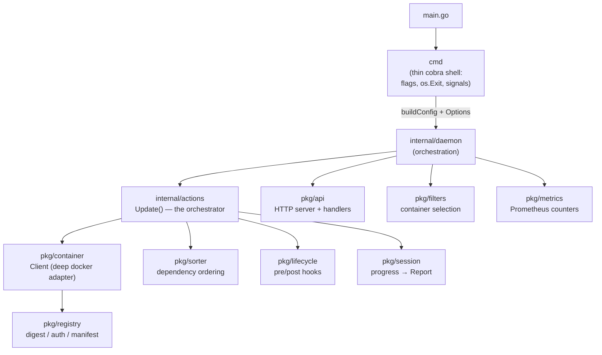
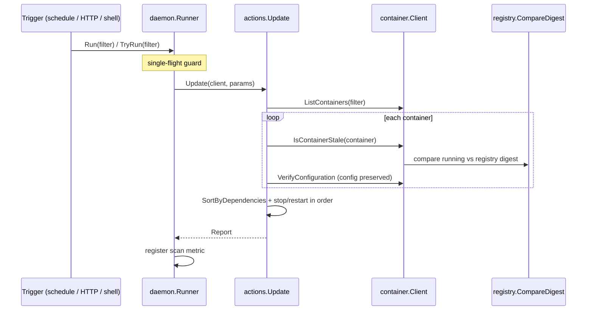

# Architecture

Dockwatch is a small Go daemon that keeps running Docker containers up to date.
It watches containers, compares their running image digest against the registry,
pulls newer images, and recreates the containers with their existing runtime
configuration.

This document describes how the code is organized and how a single update flows
through it. For usage see [HOWTO.md](HOWTO.md).

## Layers at a glance



The dependency direction is one-way: `cmd` knows about `internal/daemon`, the
daemon knows about `internal/actions` and the `pkg/*` building blocks, and none
of the packages reach back up. `pkg/types` holds the shared vocabulary
(`Container`, `Filter`, `UpdateParams`, `Report`, `ImageID`, `ContainerID`) that
everything depends on.

## Packages

| Package | Responsibility |
|---|---|
| `main.go` | Entry point. Calls `cmd.Execute()`. |
| `cmd` | Thin cobra shell. Reads flags, builds config + options, delegates to the daemon. Owns `os.Exit` and TTY detection only. |
| `internal/daemon` | The update daemon: run-mode orchestration, the single-flight runner, the cron schedule, and the interactive shell. |
| `internal/actions` | `Update()` — the real update orchestrator — plus the startup sanity checks. |
| `internal/flags` | Flag and environment-variable definitions, aliases, logging setup. |
| `internal/meta` | Compile-time `Version` / `UserAgent`. |
| `internal/util` | Small shared helpers. |
| `pkg/container` | The `Client` interface: the Docker SDK adapter, image-staleness detection, and container-config preservation on recreate. |
| `pkg/registry` | Registry digest comparison, auth, and manifest handling. |
| `pkg/filters` | Builds the container-selection predicate from names, labels, scope, and image lists. |
| `pkg/sorter` | Orders containers by dependency (`depends-on`) so restarts happen safely. |
| `pkg/lifecycle` | Executes pre- and post-update lifecycle hook commands. |
| `pkg/session` | Accumulates per-container progress into a `Report`. |
| `pkg/metrics` | Prometheus gauges/counters and the scan-registration channel. |
| `pkg/api` | The HTTP API server plus the `update` and `schedule` handlers. |
| `pkg/types` | Shared domain types used across all packages. |

## The daemon module

`internal/daemon` is where "when and how often to run" lives. It was extracted
from the cobra command so the orchestration has a real seam and is testable
without a live Docker socket or the CLI. Its pieces:

- **`Daemon.Run(Options)`** — drives the run-mode matrix (see below) and blocks
  until interrupted in periodic or interactive mode.
- **`Runner`** — runs update scans and guarantees only one runs at a time. It
  owns the single-flight guard (`Run` blocks for it, `TryRun` skips if busy,
  `Wait` drains it at shutdown). The scheduler, the shell, and the HTTP update
  handler all funnel through it instead of hand-rolling their own lock.
  The queue of callers waiting on the guard is bounded: past that, `Run` returns
  nil rather than waiting, and the HTTP handler answers `409`. Each waiter is a
  parked goroutine holding a connection that still runs a full scan when its turn
  comes, so an unbounded queue turns a burst of requests into a backlog of scans
  outliving the callers that asked for them.
- **`Controller`** — owns the cron schedule; each tick delegates to the `Runner`.
  Replacing a schedule stops the old cron before starting the new one, and a spec
  that fails to parse leaves the running schedule untouched.
- **`Config`** — the resolved, validated runtime configuration (a plain value,
  no package globals). Legality rules live in `Config.Validate()`.
- **`RunShell`** — the interactive `dockwatch>` prompt, with injected I/O.

### Run-mode matrix

`decideMode(Options)` collapses the mode decision into one pure function:

| Options | Periodic scans | HTTP API blocks the process |
|---|---|---|
| default | yes | no |
| `--http-api-update` only | no | yes |
| `--http-api-update` + `--http-api-periodic-polls` | yes | no |
| `--http-api-update` + interactive TTY | no | no |

`--run-once` / `--force-update` short-circuit before any of this: run one scan
and exit.

Shutdown is ordered, and the order carries the whole point: on a signal the cron
stops, then the HTTP API shuts down and drains its in-flight requests, and only
then does the `Runner` wait for the scan still in progress. An API-triggered
update runs the scan inline in its handler, so closing the API after that wait
would let a request start a scan the process was about to exit through — the
same shape of loss as an interrupted stop-and-recreate.

A schedule the operator explicitly enabled and an API that cannot bind are both
fatal rather than logged: carrying on left dockwatch running with no update
endpoint while still exiting 0, which reads as healthy to anything watching the
exit code.

## The update flow

A single update — however it is triggered (a scheduler tick, `POST /v1/update`,
the shell `update` command, or `--run-once`) — flows through the same path:



The crown-jewel logic is **config preservation**: when a container is recreated,
`pkg/container` diffs the running container's configuration against the image
defaults (env, cmd, entrypoint, healthcheck, ports) so the new container keeps
its original runtime settings.

## Deep modules and seams

Two modules do the heavy lifting behind simple interfaces and are the model the
rest of the code follows:

- **`container.Client`** — a small interface hiding the Docker SDK, the network
  reconnection dance, digest comparison, and config preservation. It is the
  primary test seam: `internal/actions` is tested entirely against a mock
  `Client`, with no Docker daemon.
- **`actions.Update`** — a simple `Update(client, params) (Report, error)`
  signature hiding the whole staleness → order → recreate pipeline.

Other seams used for testing:

- **`update.Scanner`** — the HTTP update handler depends on this interface, so
  it can be tested without the daemon; the single-flight guard lives behind it.
- **`daemon.Runner` / `decideMode` / `Config.Validate`** — the orchestration
  surfaces that unit tests exercise directly.

## Testing

Run the suite with:

```bash
go test ./...
```

Most packages are tested through their interfaces against fakes/mocks rather
than a live Docker daemon. When adding behavior, prefer extending a deep module
(hiding complexity behind its existing interface) over adding a new thin
pass-through package.
