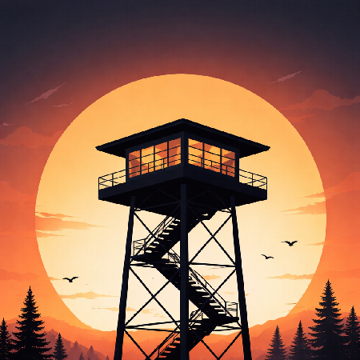

<p style="text-align: center; margin-left: 1.6rem;">
  
</p>
<h1 align="center">
  Dockwatch
</h1>

<p align="center">
  A container-based solution for automating Docker container base image updates.
  <br/><br/>
  <a href="https://circleci.com/gh/fugginold/dockwatch">
    
  </a>
  <a href="https://codecov.io/gh/fugginold/dockwatch">
    
  </a>
  <a href="https://godoc.org/github.com/fugginold/dockwatch">
    
  </a>
  <a href="https://goreportcard.com/report/github.com/fugginold/dockwatch">
    
  </a>
  <a href="https://github.com/fugginold/dockwatch/releases">
    
  </a>
  <a href="https://www.apache.org/licenses/LICENSE-2.0">
    
  </a>
  <a href="https://www.codacy.com/gh/fugginold/dockwatch/dashboard?utm_source=github.com&amp;utm_medium=referral&amp;utm_content=fugginold/dockwatch&amp;utm_campaign=Badge_Grade">
    
  </a>
  <a href="https://hub.docker.com/r/fugginold/dockwatch">
    
  </a>
</p>

## Quick Start

Dockwatch is actively maintained and continues to support automated image update workflows for Docker-based environments.

With dockwatch you can update the running version of your containerized app simply by pushing a new image to the Docker
Hub or your own image registry. Dockwatch will pull down your new image, gracefully shut down your existing container
and restart it with the same options that were used when it was deployed initially. Run the dockwatch container with
the following command:

=== "docker run"

    ```bash
    $ docker run -d \
    --name dockwatch \
    -v /var/run/docker.sock:/var/run/docker.sock \
    fugginold/dockwatch
    ```

=== "docker-compose.yml"

    ```yaml
    version: "3"
    services:
      dockwatch:
        image: fugginold/dockwatch
        volumes:
          - /var/run/docker.sock:/var/run/docker.sock
    ```
